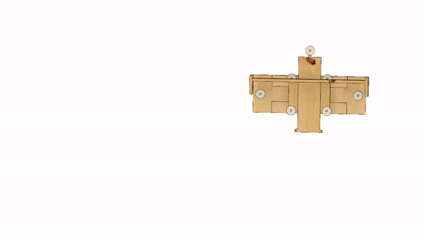
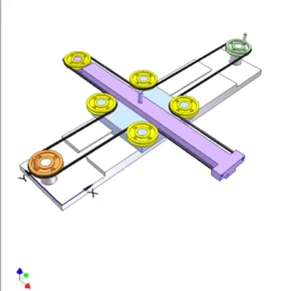

## Modelo 1 :green_heart:

Tamanho máximo das PCB: **null:null mm**

Dimensões **nullxnullxnull** mm

## Modelo 3

CAD:

gif base:

Tamanho máximo das PCB: **165:120 mm**

Dimensões **630x300x300** mm

Vantagens
  * Construção "simples".

Desvantagem
  * Grande espaço físico para manobra dos braços.
