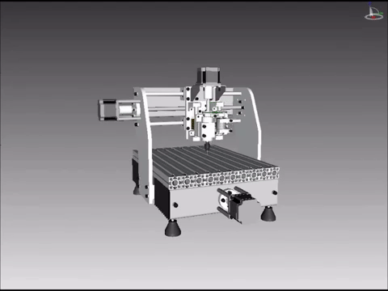
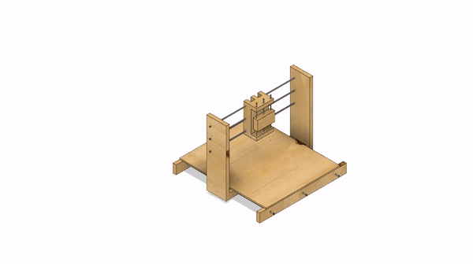
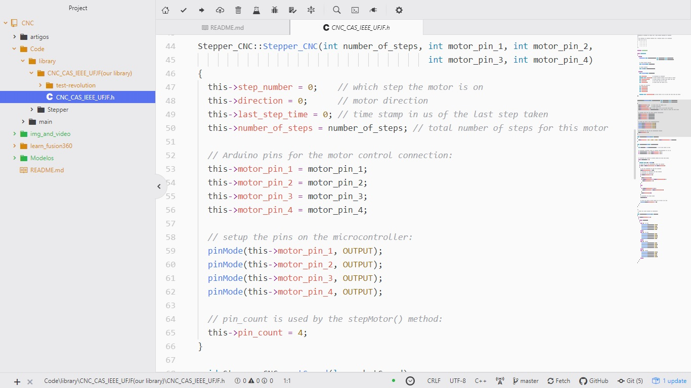

## Fresadora CNC

### Objetivo
  Fabricação de **PCB** (Printed Circuit Boards) e usinagem de peças simples.

| **Exemplos de fresadoras CNC** | **modelo atual** by fusion 360 autodesk |
| --- | --- |
|  |  |

### CNC
  CNC (Computer Numeric Control ou Controlo numérico computadorizado) é um sistema que permite o controle da máquina.

  Tipos de máquinas que são variações da CNC:
  * Fresadora
  * Torno
  * Jato de água
  * Retificadora

### Construção fresadora
  ##### Mecânica
    Modelagem de toda a estrutura usando Fusion 360. Disponível em ../Modelos/modelo_1/

  ##### Software
    Criar nossa própria biblioteca (CNC_CAS_IEEE_UFJF.h) usando como base biblioteca motor passos do Arduino (Stepper) e o Microcontrolador atual é nodeMCU (ESP8266). Disponível em ../code/

